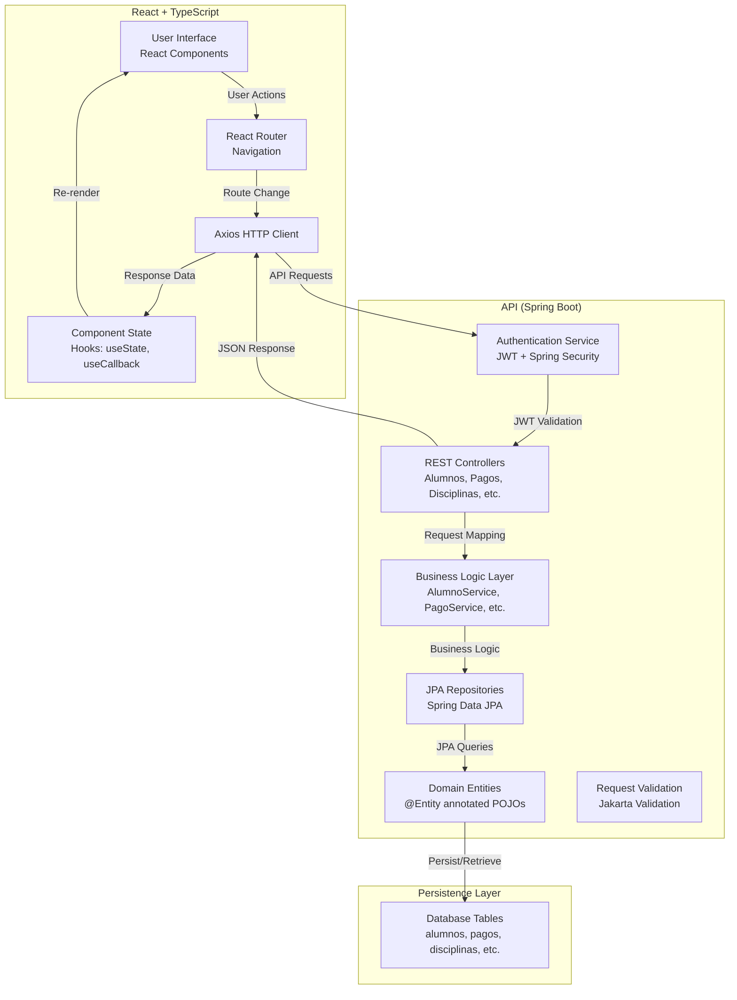
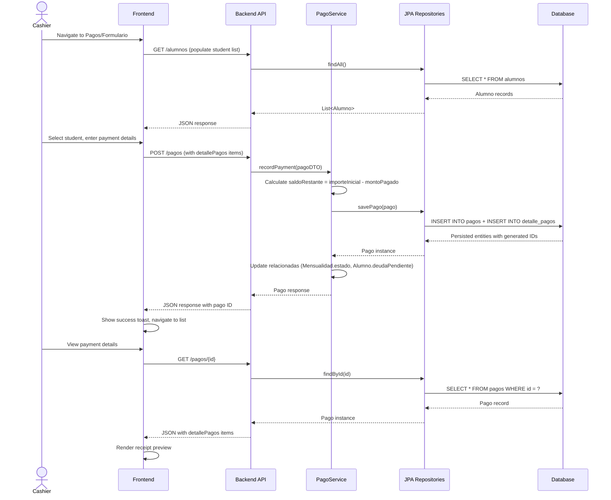
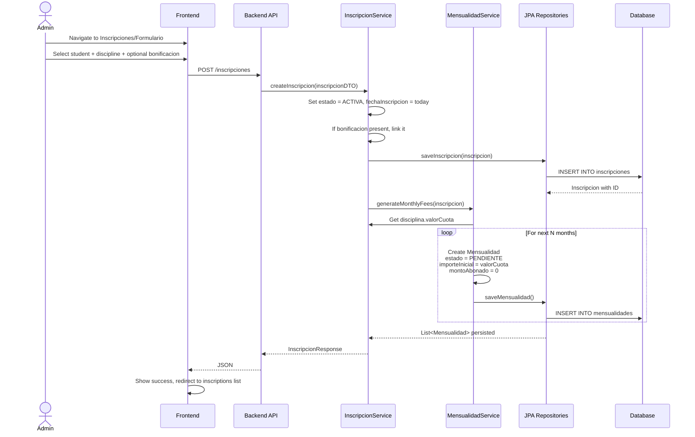

# Technical Design: Membership Management System (Le Dance)

## 1. Architectural Overview

The Membership Management System is a full-stack web application composed of:

- **Backend**: Java 17+ with Spring Boot 3, Spring Data JPA/Hibernate, Spring Security for JWT authentication, and PostgreSQL/MySQL database persistence.
- **Frontend**: React 18+ with TypeScript, React Router for navigation, Tailwind CSS for styling, and Axios for API communication.
- **Database**: Relational database (PostgreSQL or MySQL) with auto-schema generation via Hibernate DDL.
- **Deployment**: Docker containerization for both backend and frontend services with docker-compose orchestration.

### System Architecture Diagram



### Key Design Principles

1. **Separation of Concerns**: Controllers handle HTTP requests, Services contain business logic, Repositories manage data access, Entities define domain models.
2. **Logical Deletion**: All deletions are soft-deletes (set `activo=false`) to preserve audit trails and historical data.
3. **Immutable Pricing History**: When `valorCuota` changes, new `Mensualidad` records copy the current price, preserving historical rates.
4. **Flexible Payment Application**: Payments are recorded as separate entities with `montoPagado`, `saldoRestante`, and related `DetallePago` items for line-item composition.
5. **Role-Based Access Control (RBAC)**: Spring Security enforces authorization at the endpoint level based on user roles.
6. **Cascading Relationships**: Deletions cascade appropriately (e.g., deleting a student deletes their inscriptions and mensualidades).

---

## 2. Data Flow Diagram

### Payment Flow (Core Workflow)



### Enrollment and Mensualidad Generation Flow



---

## 3. Component & Interface Definitions

### 3.1 Backend - Domain Entities and Interfaces

#### Alumno Entity
```typescript
// TypeScript representation of JPA Entity

interface Alumno {
  id: Long;
  nombre: string;                    // @NotNull
  apellido: string;
  fechaNacimiento: LocalDate;
  edad: Integer;
  celular1: string;
  celular2: string;
  email: string;                    // @Email
  documento: string;
  cuit: string;
  fechaIncorporacion: LocalDate;    // @NotNull
  fechaDeBaja: LocalDate;
  deudaPendiente: boolean;
  nombrePadres: string;
  autorizadoParaSalirSolo: boolean;
  otrasNotas: string;
  cuotaTotal: Double;
  activo: boolean;                  // @NotNull, default = true
  creditoAcumulado: Double;         // default = 0.0
  inscripciones: Inscripcion[];     // One-to-Many
  matriculas: Matricula[];          // One-to-Many
}
```

#### Disciplina Entity
```typescript
interface Disciplina {
  id: Long;
  nombre: string;                   // @NotNull
  profesor: Profesor;               // @NotNull, Many-to-One
  salon: Salon;                     // Many-to-One
  valorCuota: Double;              // @NotNull
  claseSuelta: Double;             // Optional single class price
  clasePrueba: Double;             // Optional trial class price
  activo: boolean;                 // default = true
  inscripciones: Inscripcion[];    // One-to-Many
  horarios: DisciplinaHorario[];   // One-to-Many
}
```

#### Inscripcion Entity
```typescript
interface Inscripcion {
  id: Long;
  alumno: Alumno;                           // @NotNull, Many-to-One
  disciplina: Disciplina;                   // @NotNull, Many-to-One
  bonificacion: Bonificacion;               // Optional Many-to-One
  fechaInscripcion: LocalDate;              // @NotNull
  fechaBaja: LocalDate;
  estado: EstadoInscripcion;                // ACTIVA, INACTIVA, FINALIZADA
  mensualidades: Mensualidad[];             // One-to-Many
  asistenciasAlumnoMensual: AsistenciaAlumnoMensual[];
}

enum EstadoInscripcion {
  ACTIVA,
  INACTIVA,
  FINALIZADA
}
```

#### Mensualidad Entity
```typescript
interface Mensualidad {
  id: Long;
  fechaGeneracion: LocalDate;              // @NotNull
  fechaCuota: LocalDate;                   // @NotNull (month/year of the fee)
  fechaPago: LocalDate;                    // When payment was received
  valorBase: Double;                       // The rate used for calculation
  importeInicial: Double;                  // @NotNull, total amount due
  estado: EstadoMensualidad;               // PENDIENTE, PAGADO, OMITIDO
  montoAbonado: Double;                    // default = 0.0
  importePendiente: Double;                // Remaining balance
  inscripcion: Inscripcion;                // @NotNull, Many-to-One
  recargo: Recargo;                        // Optional surcharge reference
  bonificacion: Bonificacion;              // Optional discount reference
  detallePagos: DetallePago[];             // One-to-Many
  descripcion: string;
}

enum EstadoMensualidad {
  PAGADO,
  PENDIENTE,
  OMITIDO
}
```

#### Pago Entity
```typescript
interface Pago {
  id: Long;
  fecha: LocalDate;                        // @NotNull
  fechaVencimiento: LocalDate;             // Optional due date
  monto: Double;                           // @NotNull
  valorBase: Double;                       // Base value for calculation
  importeInicial: Double;                  // @NotNull, total to collect
  alumno: Alumno;                          // @NotNull, Many-to-One
  metodoPago: MetodoPago;                  // Optional Many-to-One
  saldoRestante: Double;                   // @NotNull, default = 0.0
  estadoPago: EstadoPago;                  // ACTIVO, HISTORICO, ANULADO
  observaciones: string;
  detallePagos: DetallePago[];             // One-to-Many
  montoPagado: Double;                     // Amount received, default = 0.0
  usuario: Usuario;                        // Optional cashier who recorded it
  recargoMetodoPagoAplicado: boolean;      // Surcharge applied flag
}

enum EstadoPago {
  ACTIVO,
  HISTORICO,
  ANULADO
}
```

#### DetallePago Entity
```typescript
interface DetallePago {
  id: Long;
  version: Long;
  descripcionConcepto: string;
  concepto: Concepto;                      // Optional
  subConcepto: SubConcepto;                // Optional
  cuotaOCantidad: string;
  bonificacion: Bonificacion;              // Optional discount
  recargo: Recargo;                        // Optional surcharge
  valorBase: Double;
  importeInicial: Double;
  importePendiente: Double;
  aCobrar: Double;
  pago: Pago;                              // @NotNull, Many-to-One
  mensualidad: Mensualidad;                // Optional
  matricula: Matricula;                    // Optional
  stock: Stock;                            // Optional
  alumno: Alumno;                          // @NotNull, Many-to-One
  cobrado: boolean;                        // default = false
  tipo: TipoDetallePago;                   // Line item type
  fecha_registro: LocalDateTime;           // @NotNull
}

enum TipoDetallePago {
  MENSUALIDAD,
  MATRICULA,
  CLASE_SUELTA,
  CLASE_PRUEBA,
  STOCK_VENTA,
  OTRO
}
```

#### Bonificacion Entity
```typescript
interface Bonificacion {
  id: Long;
  descripcion: string;                    // @NotNull (e.g., "1/2 BECA")
  porcentajeDescuento: Integer;           // @NotNull (e.g., 50 for 50%)
  valorFijo: Double;                      // Optional fixed discount amount
  activo: boolean;                        // default = true
  observaciones: string;
}
```

#### Recargo Entity
```typescript
interface Recargo {
  id: Long;
  descripcion: string;                    // @NotNull
  porcentaje: Double;                     // @NotNull (surcharge percentage)
  valorFijo: Double;                      // Optional fixed surcharge amount
  diaDelMesAplicacion: Integer;           // @NotNull (day of month to apply)
}
```

#### Usuario and Rol Entities
```typescript
interface Usuario extends UserDetails {
  id: Long;
  nombreUsuario: string;                  // @NotNull
  contrasena: string;                     // @NotNull (should be hashed)
  rol: Rol;                               // @NotNull, Many-to-One
  activo: boolean;                        // default = true
  // Spring UserDetails methods
  getAuthorities(): Collection<GrantedAuthority>;  // "ROLE_{rol.descripcion}"
  getPassword(): string;
  getUsername(): string;
  isAccountNonExpired(): boolean;
  isAccountNonLocked(): boolean;
  isCredentialsNonExpired(): boolean;
  isEnabled(): boolean;
}

interface Rol {
  id: Long;
  descripcion: string;                    // e.g., "ADMIN", "CAJA", "CONSULTA"
  activo: boolean;                        // default = true
}
```

#### Other Key Entities
```typescript
interface Profesor {
  id: Long;
  nombre: string;
  apellido: string;
  fechaNacimiento: LocalDate;
  telefono: string;
  edad: Integer;
  disciplinas: Disciplina[];              // One-to-Many
  usuario: Usuario;                       // Optional One-to-One
  activo: boolean;                        // default = true
}

interface Matricula {
  id: Long;
  anio: Integer;                          // @NotNull
  pagada: boolean;                        // default = false
  fechaPago: LocalDate;
  alumno: Alumno;                         // @NotNull, Many-to-One
}

interface DisciplinaHorario {
  id: Long;
  disciplina: Disciplina;                 // @NotNull, Many-to-One
  diaSemana: DiaSemana;                   // MONDAY, TUESDAY, ..., SUNDAY
  horarioInicio: LocalTime;               // @NotNull
  duracion: Double;                       // Duration in hours
}

interface Stock {
  id: Long;
  nombre: string;                         // @NotNull
  precio: Double;                         // @NotNull
  stock: Integer;                         // @NotNull (quantity)
  requiereControlDeStock: boolean;
  codigoBarras: string;
  activo: boolean;                        // default = true
  fechaIngreso: LocalDate;
  fechaEgreso: LocalDate;
  esMismoStock: boolean;
}

interface AsistenciaMensual {
  id: Long;
  mes: Integer;                           // @NotNull
  anio: Integer;                          // @NotNull
  disciplina: Disciplina;                 // @NotNull, Many-to-One
  asistenciasAlumnoMensual: AsistenciaAlumnoMensual[];
}

interface AsistenciaAlumnoMensual {
  id: Long;
  inscripcion: Inscripcion;               // @NotNull, Many-to-One
  observacion: string;
  asistenciaMensual: AsistenciaMensual;   // @NotNull, Many-to-One
  asistenciasDiarias: AsistenciaDiaria[];
}

interface AsistenciaDiaria {
  id: Long;
  fecha: LocalDate;                       // @NotNull
  estado: EstadoAsistencia;               // PRESENTE, AUSENTE, JUSTIFICADO
  asistenciaAlumnoMensual: AsistenciaAlumnoMensual[];
}

enum EstadoAsistencia {
  PRESENTE,
  AUSENTE,
  JUSTIFICADO
}

interface Egreso {
  id: Long;
  fecha: LocalDate;                       // @NotNull
  monto: Double;                          // @NotNull
  observaciones: string;
  metodoPago: MetodoPago;
  activo: boolean;                        // default = true
}

interface MetodoPago {
  id: Long;
  descripcion: string;                    // @NotNull (e.g., "Efectivo", "Transferencia")
  activo: boolean;                        // default = true
  recargo: Double;                        // Optional surcharge %
}

interface Salon {
  id: Long;
  nombre: string;                         // @NotNull
  descripcion: string;
}

interface Concepto {
  id: Long;
  descripcion: string;
  precio: Double;
  subConcepto: SubConcepto;               // @NotNull, Many-to-One
}

interface SubConcepto {
  id: Long;
  descripcion: string;
}

interface Notificacion {
  id: Long;
  usuarioId: Long;                        // @NotNull
  tipo: string;                           // e.g., "CUMPLEANOS", "ALERTA", "MENSAJE"
  mensaje: string;                        // @NotNull
  fechaCreacion: LocalDateTime;           // @NotNull
  leida: boolean;                         // default = false
}

interface ObservacionProfesor {
  id: Long;
  profesor: Profesor;                     // @NotNull, Many-to-One
  fecha: LocalDate;                       // @NotNull
  observacion: string;                    // Observation text
}
```

### 3.2 Frontend - React Components

#### Page Components (in `funcionalidades/` folder)

```typescript
// AlumnosPagina.tsx
interface AlumnoListado {
  id: number;
  nombre: string;
  apellido: string;
  activo: boolean;
}

export const AlumnosPagina: React.FC = () => {
  // Displays paginated list with search, filter (active/inactive), and CRUD actions
}

// PagosPagina.tsx
export const PagosPagina: React.FC = () => {
  // Displays all payments sorted by most recent, with links to payment form and details
}

// InscripcionesPagina.tsx
export const InscripcionesPagina: React.FC = () => {
  // Groups enrollments by student, calculates total cost per student
}

// CajaPagina.tsx
export const CajaPagina: React.FC = () => {
  // Displays daily cash records with inflow breakdown by payment method
}

// And similar pages for:
// - DisciplinasPagina
// - ProfesoresPagina
// - MonsualidadPagina
// - BonificacionesPagina
// - RecargosPagina
// - StocksPagina
// - UsuariosPagina
// - RolesPagina
// - AsistenciaMensualDetalle
// - EgresosPagina
// - MetodosPagoPagina
// - SalonesPagina
// - ConceptosPagina
// - SubConceptosPagina
// - etc.
```

#### Common Components

```typescript
// Tabla.tsx - Generic table component
interface TablaProps<T> {
  headers: string[];
  data: T[];
  customRender?: (row: T) => (string | React.ReactNode)[];
  onRowClick?: (row: T) => void;
}

// ListaConInfiniteScroll.tsx
interface ListaConInfiniteScrollProps<T> {
  items: T[];
  hasMore: boolean;
  onLoadMore: () => void;
  renderItem: (item: T) => React.ReactNode;
}

// InfiniteScroll.tsx
interface InfiniteScrollProps {
  hasMore: boolean;
  isLoading: boolean;
  onLoadMore: () => void;
}

// Boton.tsx - Generic button component
interface BotonProps extends React.ButtonHTMLAttributes<HTMLButtonElement> {
  className?: string;
  children: React.ReactNode;
}
```

---

## 4. API Endpoint Definitions

### 4.1 Authentication Endpoints

#### POST /auth/login
- **Request Body**: `{ "nombreUsuario": "string", "contrasena": "string" }`
- **Success Response (200)**: `{ "token": "jwt_token", "usuario": { "id": Long, "nombreUsuario": "string", "rol": { "id": Long, "descripcion": "string" } } }`
- **Error Response (401)**: `{ "error": "Invalid credentials" }`

#### POST /auth/logout
- **Request Headers**: `Authorization: Bearer {token}`
- **Success Response (200)**: `{ "message": "Logged out successfully" }`

#### GET /auth/perfil
- **Request Headers**: `Authorization: Bearer {token}`
- **Success Response (200)**: `{ "id": Long, "nombreUsuario": "string", "rol": { "descripcion": "string" } }`

---

### 4.2 Student (Alumno) Endpoints

#### GET /alumnos
- **Query Parameters**: `page=0&size=50`, `search="nombre"`, `filter=activos|inactivos|todos`
- **Success Response (200)**: `{ "content": [Alumno], "totalPages": Integer, "totalElements": Long }`

#### GET /alumnos/{id}
- **Success Response (200)**: `Alumno`
- **Error Response (404)**: `{ "error": "Alumno not found" }`

#### POST /alumnos
- **Request Body**: `{ "nombre": "string", "apellido": "string", "fechaIncorporacion": "YYYY-MM-DD", ... }`
- **Success Response (201)**: `Alumno` with generated id
- **Error Response (400)**: `{ "errors": { "nombre": "must not be null", ... } }`

#### PUT /alumnos/{id}
- **Request Body**: `{ "nombre": "string", ... fields to update ... }`
- **Success Response (200)**: `Alumno`
- **Error Response (400)**: Validation errors
- **Error Response (404)**: `{ "error": "Alumno not found" }`

#### DELETE /alumnos/{id}
- **Success Response (204)**: No content (logically deletes by setting `activo=false`)
- **Error Response (404)**: `{ "error": "Alumno not found" }`

---

### 4.3 Discipline (Disciplina) Endpoints

#### GET /disciplinas
- **Query Parameters**: `search="nombre"`, `sortOrder=asc|desc`
- **Success Response (200)**: `[Disciplina]`

#### GET /disciplinas/{id}
- **Success Response (200)**: `Disciplina` with nested `horarios` array

#### POST /disciplinas
- **Request Body**: `{ "nombre": "string", "profesor": { "id": Long }, "valorCuota": Double, "salon": { "id": Long }, ... }`
- **Success Response (201)**: `Disciplina`
- **Error Response (400)**: Validation errors (e.g., profesor required, valorCuota required)

#### PUT /disciplinas/{id}
- **Request Body**: `{ Updated Disciplina fields }`
- **Success Response (200)**: `Disciplina`

#### DELETE /disciplinas/{id}
- **Success Response (204)**: No content

---

### 4.4 Enrollment (Inscripcion) Endpoints

#### GET /inscripciones
- **Success Response (200)**: `[Inscripcion]` grouped by student with calculated totals

#### POST /inscripciones
- **Request Body**: `{ "alumno": { "id": Long }, "disciplina": { "id": Long }, "fechaInscripcion": "YYYY-MM-DD", "bonificacion": { "id": Long } (optional) }`
- **Success Response (201)**: `Inscripcion` with auto-generated `mensualidades`
- **Error Response (400)**: Validation errors

#### PUT /inscripciones/{id}
- **Request Body**: `{ "estado": "INACTIVA|FINALIZADA", "fechaBaja": "YYYY-MM-DD", ... }`
- **Success Response (200)**: `Inscripcion`

#### DELETE /inscripciones/{id}
- **Success Response (204)**: No content

---

### 4.5 Monthly Fee (Mensualidad) Endpoints

#### GET /mensualidades
- **Query Parameters**: `page=0&size=50`, `alumno_id={id}`, `estado=PENDIENTE|PAGADO|OMITIDO`
- **Success Response (200)**: `PageResponse<Mensualidad>`

#### GET /mensualidades/{id}
- **Success Response (200)**: `Mensualidad`

#### POST /mensualidades
- **Request Body**: `{ "inscripcion": { "id": Long }, "fechaCuota": "YYYY-MM-DD", "importeInicial": Double }`
- **Success Response (201)**: `Mensualidad`

#### PUT /mensualidades/{id}
- **Request Body**: `{ "estado": "PAGADO|OMITIDO", "montoAbonado": Double, "fechaPago": "YYYY-MM-DD" }`
- **Success Response (200)**: `Mensualidad`

---

### 4.6 Payment (Pago) Endpoints

#### GET /pagos
- **Query Parameters**: `page=0&limit=25`
- **Success Response (200)**: `[PagoResponse]` sorted by most recent first

#### GET /pagos/{id}
- **Success Response (200)**: `Pago` with nested `detallePagos`

#### POST /pagos
- **Request Body**:
```json
{
  "alumno": { "id": Long },
  "fecha": "YYYY-MM-DD",
  "importeInicial": Double,
  "montoPagado": Double,
  "metodoPago": { "id": Long },
  "detallePagos": [
    {
      "descripcionConcepto": "string",
      "aCobrar": Double,
      "mensualidad": { "id": Long } (optional),
      "stock": { "id": Long } (optional),
      "tipo": "MENSUALIDAD|CLASE_SUELTA|STOCK_VENTA"
    }
  ]
}
```
- **Success Response (201)**: `Pago` with calculated `saldoRestante = importeInicial - montoPagado`
- **Error Response (400)**: Validation errors

#### PUT /pagos/{id}
- **Request Body**: `{ "montoPagado": Double, "fecha": "YYYY-MM-DD", "observaciones": "string" }`
- **Success Response (200)**: `Pago` with updated balances

#### DELETE /pagos/{id}
- **Success Response (204)**: No content (or updates `estadoPago=ANULADO`)

---

### 4.7 Payment Details (DetallePago) Endpoints

#### GET /detalles-pago
- **Query Parameters**: `pago_id={id}`, `alumno_id={id}`
- **Success Response (200)**: `[DetallePago]`

#### POST /detalles-pago
- **Request Body**: `{ "pago": { "id": Long }, "alumno": { "id": Long }, "aCobrar": Double, "tipo": "MENSUALIDAD|...", ... }`
- **Success Response (201)**: `DetallePago`

#### PUT /detalles-pago/{id}
- **Request Body**: `{ "cobrado": true, "importePendiente": Double }`
- **Success Response (200)**: `DetallePago`

---

### 4.8 Discount (Bonificacion) Endpoints

#### GET /bonificaciones
- **Success Response (200)**: `[Bonificacion]`

#### GET /bonificaciones/{id}
- **Success Response (200)**: `Bonificacion`

#### POST /bonificaciones
- **Request Body**: `{ "descripcion": "string", "porcentajeDescuento": Integer, "valorFijo": Double (optional) }`
- **Success Response (201)**: `Bonificacion`

#### PUT /bonificaciones/{id}
- **Request Body**: `{ "descripcion": "string", "porcentajeDescuento": Integer, ... }`
- **Success Response (200)**: `Bonificacion`

#### DELETE /bonificaciones/{id}
- **Success Response (204)**: No content

---

### 4.9 Surcharge (Recargo) Endpoints

#### GET /recargos
- **Success Response (200)**: `[Recargo]`

#### POST /recargos
- **Request Body**: `{ "descripcion": "string", "porcentaje": Double, "valorFijo": Double (optional), "diaDelMesAplicacion": Integer }`
- **Success Response (201)**: `Recargo`

#### PUT /recargos/{id}
- **Success Response (200)**: `Recargo`

#### DELETE /recargos/{id}
- **Success Response (204)**: No content

---

### 4.10 Daily Cash (Caja) Endpoints

#### GET /cajas
- **Query Parameters**: `page=0&size=25`
- **Success Response (200)**: `PageResponse<CajaResponse>`

#### GET /cajas/{id}
- **Success Response (200)**: `CajaResponse`

#### POST /cajas
- **Request Body**: `{ "fecha": "YYYY-MM-DD", "totalEfectivo": Double, "totalTransferencia": Double, "observaciones": "string" }`
- **Success Response (201)**: `CajaResponse`

---

### 4.11 Expense (Egreso) Endpoints

#### GET /egresos
- **Success Response (200)**: `[Egreso]`

#### POST /egresos
- **Request Body**: `{ "fecha": "YYYY-MM-DD", "monto": Double, "metodoPago": { "id": Long (optional) }, "observaciones": "string" }`
- **Success Response (201)**: `Egreso`

#### PUT /egresos/{id}
- **Success Response (200)**: `Egreso`

#### DELETE /egresos/{id}
- **Success Response (204)**: No content

---

### 4.12 Payment Method (MetodoPago) Endpoints

#### GET /metodo-pagos
- **Success Response (200)**: `[MetodoPago]`

#### POST /metodo-pagos
- **Request Body**: `{ "descripcion": "string", "recargo": Double (optional) }`
- **Success Response (201)**: `MetodoPago`

#### PUT /metodo-pagos/{id}
- **Success Response (200)**: `MetodoPago`

#### DELETE /metodo-pagos/{id}
- **Success Response (204)**: No content

---

### 4.13 User (Usuario) Endpoints

#### GET /usuarios
- **Success Response (200)**: `[UsuarioResponse]`

#### POST /usuarios
- **Request Body**: `{ "nombreUsuario": "string", "contrasena": "string", "rol": { "id": Long } }`
- **Success Response (201)**: `UsuarioResponse`

#### PUT /usuarios/{id}
- **Request Body**: `{ "nombreUsuario": "string", "rol": { "id": Long } }`
- **Success Response (200)**: `UsuarioResponse`

#### DELETE /usuarios/{id}
- **Success Response (204)**: No content

---

### 4.14 Role (Rol) Endpoints

#### GET /roles
- **Success Response (200)**: `[Rol]`

#### POST /roles
- **Request Body**: `{ "descripcion": "string" }`
- **Success Response (201)**: `Rol`

#### PUT /roles/{id}
- **Success Response (200)**: `Rol`

#### DELETE /roles/{id}
- **Success Response (204)**: No content

---

### 4.15 Professor (Profesor) Endpoints

#### GET /profesores
- **Success Response (200)**: `[Profesor]`

#### POST /profesores
- **Request Body**: `{ "nombre": "string", "apellido": "string", "fechaNacimiento": "YYYY-MM-DD", "telefono": "string" }`
- **Success Response (201)**: `Profesor`

#### PUT /profesores/{id}
- **Success Response (200)**: `Profesor`

#### DELETE /profesores/{id}
- **Success Response (204)**: No content

---

### 4.16 Stock Endpoints

#### GET /stocks
- **Success Response (200)**: `[Stock]`

#### POST /stocks
- **Request Body**: `{ "nombre": "string", "precio": Double, "stock": Integer, "codigoBarras": "string" (optional) }`
- **Success Response (201)**: `Stock`

#### PUT /stocks/{id}
- **Request Body**: `{ "precio": Double, "stock": Integer }`
- **Success Response (200)**: `Stock`

#### DELETE /stocks/{id}
- **Success Response (204)**: No content

---

### 4.17 Attendance (Asistencia) Endpoints

#### GET /asistencias-mensuales
- **Query Parameters**: `mes=1&anio=2026&disciplina_id={id}`
- **Success Response (200)**: `[AsistenciaMensual]`

#### POST /asistencias-mensuales
- **Request Body**: `{ "mes": Integer, "anio": Integer, "disciplina": { "id": Long } }`
- **Success Response (201)**: `AsistenciaMensual` with auto-generated `asistenciasAlumnoMensual`

#### GET /asistencias-alumno-mensual/{id}
- **Success Response (200)**: `AsistenciaAlumnoMensual` with nested `asistenciasDiarias`

#### POST /asistencias-diarias
- **Request Body**: `{ "fecha": "YYYY-MM-DD", "estado": "PRESENTE|AUSENTE|JUSTIFICADO", "asistenciaAlumnoMensual": { "id": Long } }`
- **Success Response (201)**: `AsistenciaDiaria`

---

### 4.18 Notification (Notificacion) Endpoints

#### GET /notificaciones
- **Query Parameters**: `leida=false` (optional)
- **Success Response (200)**: `[Notificacion]`

#### PUT /notificaciones/{id}
- **Request Body**: `{ "leida": true }`
- **Success Response (200)**: `Notificacion`

---

### 4.19 Shared Response Types

```typescript
interface PageResponse<T> {
  content: T[];
  totalPages: Integer;
  totalElements: Long;
  currentPage: Integer;
  pageSize: Integer;
}

interface ErrorResponse {
  error: string;
  timestamp: LocalDateTime;
  path: string;
  status: Integer;
}

interface ValidationErrorResponse {
  errors: Record<string, string[]>;
  timestamp: LocalDateTime;
}
```

---

## 5. Database Schema (Key Tables)

### Tables Overview

```sql
-- Students/Members
CREATE TABLE alumnos (
  id BIGINT PRIMARY KEY AUTO_INCREMENT,
  nombre VARCHAR(255) NOT NULL,
  apellido VARCHAR(255),
  fecha_nacimiento DATE,
  edad INT,
  celular1 VARCHAR(20),
  celular2 VARCHAR(20),
  email VARCHAR(255),
  documento VARCHAR(50),
  cuit VARCHAR(50),
  fecha_incorporacion DATE NOT NULL,
  fecha_de_baja DATE,
  deuda_pendiente BOOLEAN DEFAULT FALSE,
  nombre_padres VARCHAR(255),
  autorizado_para_salir_solo BOOLEAN,
  otras_notas TEXT,
  cuota_total DECIMAL(10,2),
  activo BOOLEAN NOT NULL DEFAULT TRUE,
  credito_acumulado DECIMAL(10,2) DEFAULT 0.0,
  created_at TIMESTAMP DEFAULT CURRENT_TIMESTAMP,
  updated_at TIMESTAMP DEFAULT CURRENT_TIMESTAMP ON UPDATE CURRENT_TIMESTAMP
);

-- Disciplines/Classes
CREATE TABLE disciplinas (
  id BIGINT PRIMARY KEY AUTO_INCREMENT,
  nombre VARCHAR(255) NOT NULL,
  profesor_id BIGINT NOT NULL,
  salon_id BIGINT,
  valor_cuota DECIMAL(10,2) NOT NULL,
  clase_suelta DECIMAL(10,2),
  clase_prueba DECIMAL(10,2),
  activo BOOLEAN DEFAULT TRUE,
  FOREIGN KEY (profesor_id) REFERENCES profesores(id),
  FOREIGN KEY (salon_id) REFERENCES salones(id)
);

-- Enrollments
CREATE TABLE inscripciones (
  id BIGINT PRIMARY KEY AUTO_INCREMENT,
  alumno_id BIGINT NOT NULL,
  disciplina_id BIGINT NOT NULL,
  bonificacion_id BIGINT,
  fecha_inscripcion DATE NOT NULL,
  fecha_baja DATE,
  estado VARCHAR(50) NOT NULL,
  FOREIGN KEY (alumno_id) REFERENCES alumnos(id) ON DELETE CASCADE,
  FOREIGN KEY (disciplina_id) REFERENCES disciplinas(id) ON DELETE CASCADE,
  FOREIGN KEY (bonificacion_id) REFERENCES bonificaciones(id)
);

-- Monthly Fees
CREATE TABLE mensualidades (
  id BIGINT PRIMARY KEY AUTO_INCREMENT,
  fecha_generacion DATE NOT NULL,
  fecha_cuota DATE NOT NULL,
  fecha_pago DATE,
  valor_base DECIMAL(10,2),
  importe_inicial DECIMAL(10,2) NOT NULL,
  estado VARCHAR(50) NOT NULL,
  monto_abonado DECIMAL(10,2) DEFAULT 0.0,
  importe_pendiente DECIMAL(10,2),
  inscripcion_id BIGINT NOT NULL,
  recargo_id BIGINT,
  bonificacion_id BIGINT,
  descripcion TEXT,
  FOREIGN KEY (inscripcion_id) REFERENCES inscripciones(id) ON DELETE CASCADE,
  FOREIGN KEY (recargo_id) REFERENCES recargos(id),
  FOREIGN KEY (bonificacion_id) REFERENCES bonificaciones(id)
);

-- Payments
CREATE TABLE pagos (
  id BIGINT PRIMARY KEY AUTO_INCREMENT,
  fecha DATE NOT NULL,
  fecha_vencimiento DATE,
  monto DECIMAL(10,2) NOT NULL,
  valor_base DECIMAL(10,2),
  importe_inicial DECIMAL(10,2) NOT NULL,
  alumno_id BIGINT NOT NULL,
  metodo_pago_id BIGINT,
  saldo_restante DECIMAL(10,2) NOT NULL DEFAULT 0.0,
  estado_pago VARCHAR(50) NOT NULL,
  observaciones TEXT,
  monto_pagado DECIMAL(10,2) DEFAULT 0.0,
  usuario_id BIGINT,
  recargo_aplicado BOOLEAN DEFAULT FALSE,
  FOREIGN KEY (alumno_id) REFERENCES alumnos(id),
  FOREIGN KEY (metodo_pago_id) REFERENCES metodo_pagos(id) ON DELETE SET NULL,
  FOREIGN KEY (usuario_id) REFERENCES usuarios(id)
);

-- Payment Detail Items
CREATE TABLE detalle_pagos (
  id BIGINT PRIMARY KEY AUTO_INCREMENT,
  version BIGINT,
  descripcion_concepto VARCHAR(255),
  concepto_id BIGINT,
  subconcepto_id BIGINT,
  cuota_o_cantidad VARCHAR(50),
  bonificacion_id BIGINT,
  recargo_id BIGINT,
  valor_base DECIMAL(10,2),
  importe_inicial DECIMAL(10,2),
  importe_pendiente DECIMAL(10,2),
  a_cobrar DECIMAL(10,2),
  pago_id BIGINT NOT NULL,
  mensualidad_id BIGINT,
  matricula_id BIGINT,
  stock_id BIGINT,
  alumno_id BIGINT NOT NULL,
  cobrado BOOLEAN DEFAULT FALSE,
  tipo VARCHAR(50) NOT NULL,
  fecha_registro TIMESTAMP NOT NULL,
  UNIQUE KEY (alumno_id, matricula_id),
  UNIQUE KEY (alumno_id, mensualidad_id),
  FOREIGN KEY (pago_id) REFERENCES pagos(id) ON DELETE CASCADE,
  FOREIGN KEY (mensualidad_id) REFERENCES mensualidades(id),
  FOREIGN KEY (alumno_id) REFERENCES alumnos(id)
);

-- Discounts
CREATE TABLE bonificaciones (
  id BIGINT PRIMARY KEY AUTO_INCREMENT,
  descripcion VARCHAR(255) NOT NULL,
  porcentaje_descuento INT NOT NULL,
  valor_fijo DECIMAL(10,2),
  activo BOOLEAN DEFAULT TRUE,
  observaciones TEXT
);

-- Surcharges
CREATE TABLE recargos (
  id BIGINT PRIMARY KEY AUTO_INCREMENT,
  descripcion VARCHAR(255) NOT NULL,
  porcentaje DECIMAL(5,2) NOT NULL,
  valor_fijo DECIMAL(10,2),
  dia_del_mes_aplicacion INT NOT NULL
);

-- Payment Methods
CREATE TABLE metodo_pagos (
  id BIGINT PRIMARY KEY AUTO_INCREMENT,
  descripcion VARCHAR(255) NOT NULL,
  recargo DECIMAL(5,2),
  activo BOOLEAN DEFAULT TRUE
);

-- Users
CREATE TABLE usuarios (
  id BIGINT PRIMARY KEY AUTO_INCREMENT,
  nombre_usuario VARCHAR(255) NOT NULL UNIQUE,
  contrasena VARCHAR(512) NOT NULL,
  rol_id BIGINT NOT NULL,
  activo BOOLEAN DEFAULT TRUE,
  FOREIGN KEY (rol_id) REFERENCES roles(id)
);

-- Roles
CREATE TABLE roles (
  id BIGINT PRIMARY KEY AUTO_INCREMENT,
  descripcion VARCHAR(100) NOT NULL UNIQUE,
  activo BOOLEAN DEFAULT TRUE
);

-- Professors
CREATE TABLE profesores (
  id BIGINT PRIMARY KEY AUTO_INCREMENT,
  nombre VARCHAR(255) NOT NULL,
  apellido VARCHAR(255) NOT NULL,
  fecha_nacimiento DATE,
  telefono VARCHAR(20),
  edad INT,
  usuario_id BIGINT,
  activo BOOLEAN DEFAULT TRUE,
  FOREIGN KEY (usuario_id) REFERENCES usuarios(id) ON DELETE SET NULL,
  UNIQUE KEY (usuario_id)
);

-- Classrooms
CREATE TABLE salones (
  id BIGINT PRIMARY KEY AUTO_INCREMENT,
  nombre VARCHAR(255) NOT NULL,
  descripcion TEXT
);

-- Stock
CREATE TABLE stocks (
  id BIGINT PRIMARY KEY AUTO_INCREMENT,
  nombre VARCHAR(255) NOT NULL,
  precio DECIMAL(10,2) NOT NULL,
  stock INT NOT NULL,
  requiere_control_de_stock BOOLEAN,
  codigo_barras VARCHAR(255),
  activo BOOLEAN DEFAULT TRUE,
  fecha_ingreso DATE,
  fecha_egreso DATE,
  es_mismo_stock BOOLEAN DEFAULT FALSE
);

-- Annual Registration (Matrícula)
CREATE TABLE matriculas (
  id BIGINT PRIMARY KEY AUTO_INCREMENT,
  anio INT NOT NULL,
  pagada BOOLEAN DEFAULT FALSE,
  fecha_pago DATE,
  alumno_id BIGINT NOT NULL,
  FOREIGN KEY (alumno_id) REFERENCES alumnos(id) ON DELETE CASCADE
);

-- Additional tables for Conceptos, SubConceptos, Notificaciones, Asistencias (omitted for brevity)
```

---

## 6. Security Considerations

### 6.1 Authentication & Authorization

1. **JWT Tokens**: Upon login, the backend issues a JWT token containing:
   - `sub`: Usuario ID
   - `username`: nombreUsuario
   - `roles`: Usuario's Rol descripcion
   - `iat`: Issued at timestamp
   - `exp`: Expiration (default 24 hours)

2. **Token Validation**: Every API request requires a valid JWT token in the `Authorization: Bearer {token}` header. Expired or missing tokens receive a 401 Unauthorized response.

3. **Role-Based Access Control**:
   - **ADMIN**: Full access to all endpoints and CRUD operations
   - **CAJA**: Access to `/pagos`, `/cajas`, `/egresos`, `/metodo-pagos`, read-only `/alumnos`, `/inscripciones`, `/mensualidades`
   - **CONSULTA**: Read-only access to all endpoints, no write/delete operations
   - **PROFESOR**: Access to `/asistencias-mensuales`, `/asistencias-diarias`, `/observaciones-profesores`, read-only `/alumnos`, `/inscripciones`

### 6.2 Input Validation

1. **Jakarta Validation Annotations**: All entity fields are annotated with constraints:
   - `@NotNull`: Fields that must not be null
   - `@NotBlank`: Strings that must not be empty
   - `@Email`: Email format validation
   - `@Min`, `@Max`: Numeric range validation
   - `@Pattern`: Regular expression validation

2. **Request Validation**: Spring's `@Valid` annotation triggers validation before controller methods execute.

3. **Error Messages**: Validation failures return 400 Bad Request with structured error details:
```json
{
  "errors": {
    "nombre": ["must not be null"],
    "email": ["must be a well-formed email address"]
  }
}
```

### 6.3 SQL Injection Prevention

- All database queries use parameterized queries via JPA Repositories and Spring Data.
- No string concatenation in SQL queries.
- JPA automatically escapes parameters.

### 6.4 Data Integrity

1. **Referential Integrity**: Foreign key constraints enforce relationships:
   - Enrollments must reference existing Students and Disciplines
   - Payments must reference existing Students
   - Payment details must reference valid Payments and Students

2. **Transactional Consistency**: Complex operations (e.g., payment with multiple detail items) use `@Transactional` to ensure all-or-nothing semantics.

3. **Soft Deletes**: All deletions are logical (`activo=false`) to preserve audit trails and historical data, preventing data loss.

### 6.5 Password Security

- Passwords should be hashed using BCryptPasswordEncoder before storage (implementation should use Spring Security's password encoder bean).
- Never log or expose plaintext passwords in error messages or response bodies.

### 6.6 CORS and HTTPS

- **CORS**: Backend should configure CORS to allow requests only from the frontend origin (e.g., `http://localhost:3000` in dev, `https://domain.com` in prod).
- **HTTPS**: Enforce HTTPS in production to prevent man-in-the-middle attacks on JWT tokens.

### 6.7 API Rate Limiting

- Consider implementing rate limiting on authentication endpoints to prevent brute-force password attacks.
- Example: Max 5 login attempts per IP per 15 minutes.

---

## 7. Test Strategy

### 7.1 Unit Tests

**Scope**: Test individual service methods and entity business logic in isolation.

**Examples**:
```java
// PagoServiceTest.java
@Test
void testSaldoRestanteCalculation() {
  // GIVEN a payment with importeInicial=100 and montoPagado=60
  Pago pago = new Pago(/* ... */);
  // WHEN calculating saldoRestante
  Double saldoRestante = pago.getImporteInicial() - pago.getMontoPagado();
  // THEN saldoRestante should equal 40
  assertEquals(40, saldoRestante);
}

// InscripcionServiceTest.java
@Test
void testBonificacionAplicada() {
  // GIVEN an enrollment with a 50% discount
  Inscripcion inscripcion = new Inscripcion(/* bonificacion 50% */);
  Double precioOriginal = 100.0;
  // WHEN calculating final price
  Double precioFinal = inscripcion.calcularCostoFinal(precioOriginal);
  // THEN price should be 50 (100 - 50% discount)
  assertEquals(50, precioFinal);
}
```

**Coverage Target**: ≥ 80% for service classes.

### 7.2 Integration Tests

**Scope**: Test interactions between service layer, repository layer, and database.

**Examples**:
```java
// PagoRepositoryTest.java
@DataJpaTest
class PagoRepositoryTest {
  @Autowired
  private PagoRepository pagoRepository;
  @Autowired
  private AlumnoRepository alumnoRepository;

  @Test
  void testFindPagosByAlumnoId() {
    // GIVEN an alumno with multiple pagos
    Alumno alumno = alumnoRepository.save(new Alumno(/* ... */));
    Pago pago1 = pagoRepository.save(new Pago(alumno, /* ... */));
    Pago pago2 = pagoRepository.save(new Pago(alumno, /* ... */));
    
    // WHEN querying pagos by alumnoId
    List<Pago> result = pagoRepository.findByAlumnoId(alumno.getId());
    
    // THEN should return both pagos
    assertEquals(2, result.size());
    assertTrue(result.contains(pago1));
    assertTrue(result.contains(pago2));
  }
}
```

**Coverage Target**: ≥ 70% for repository interfaces.

### 7.3 End-to-End (E2E) Tests

**Scope**: Test complete workflows from frontend UI through backend API and database.

**Examples (Using Selenium or Cypress)**:
```javascript
// Payment workflow E2E test
describe('Payment Recording Workflow', () => {
  it('should record a payment and update balances', () => {
    cy.visit('http://localhost:3000/pagos/formulario');
    cy.get('input[name="alumnoId"]').select('Student 1');
    cy.get('input[name="monto"]').type('150.00');
    cy.get('select[name="metodoPago"]').select('Efectivo');
    cy.get('button[type="submit"]').click();
    
    // Verify payment recorded
    cy.get('.alert-success').should('contain', 'Pago registrado exitosamente');
    
    // Navigate to payment list
    cy.visit('http://localhost:3000/pagos');
    cy.get('table tbody tr').first().should('contain', '150.00');
    
    // Verify saldoRestante updated in database
    cy.request('GET', '/api/pagos').then(response => {
      const latestPago = response.body[0];
      expect(latestPago.estadoPago).to.equal('ACTIVO');
    });
  });
});
```

**Test Cases**:
1. **Student Enrollment Workflow**: Create student → Enroll in discipline → Verify monthly fees generated
2. **Payment Application**: Record payment → Apply to multiple mensualidades → Verify balances updated
3. **Attendance Recording**: Create monthly sheet → Mark attendance → Verify roll captured
4. **Discount Application**: Apply bonificacion to enrollment → Verify reduced fee in mensualidades
5. **Cash Reconciliation**: Record ingresos → Record egresos → Verify daily balance calculated

**Coverage Target**: ≥ 50% for critical workflows.

### 7.4 Performance Tests

**Scope**: Verify response times and scalability with large datasets.

**Scenarios**:
1. **Load Test**: Simulate 100 concurrent users accessing `/pagos` list; verify response time ≤ 2 seconds.
2. **Infinite Scroll**: Load 1000+ alumnos with infinite scroll pagination; verify memory consumption ≤ 200MB.
3. **Report Generation**: Export 1 year of payment history for 500+ students; verify completion ≤ 30 seconds.

### 7.5 Security Tests

**Scope**: Verify authentication, authorization, and input validation.

**Test Cases**:
1. **Invalid JWT**: Request with expired/malformed token receives 401 Unauthorized.
2. **Unauthorized Access**: CAJA user attempts DELETE `/alumnos/{id}`; receives 403 Forbidden.
3. **SQL Injection**: Submit `name' OR '1'='1` in search field; verify no injection vulnerability.
4. **XSS Prevention**: Submit HTML/JavaScript in text fields; verify output is properly escaped.
5. **CSRF Protection**: POST request without CSRF token (if applicable) receives 403 Forbidden.

---

## 8. Implementation Roadmap (Phases)

### Phase 1: Core Infrastructure (Week 1-2)
- [x] Database schema creation
- [ ] Spring Boot REST API scaffolding
- [ ] JWT authentication implementation
- [ ] Role-based authorization configuration
- [ ] React frontend setup with API integration

### Phase 2: Student & Enrollment Management (Week 3-4)
- [ ] Alumno CRUD endpoints
- [ ] Alumno frontend page (list, create, edit, delete)
- [ ] Inscripcion CRUD endpoints
- [ ] Inscripcion frontend page
- [ ] Auto-generation of Mensualidades on enrollment

### Phase 3: Payment & Billing (Week 5-7)
- [ ] Pago and DetallePago endpoints
- [ ] Payment form with multi-item support
- [ ] Mensualidad endpoints
- [ ] Payment listing and tracking
- [ ] Receipt generation

### Phase 4: Financial Management (Week 8-9)
- [ ] Caja (daily cash) endpoints and UI
- [ ] Egreso (expense) endpoints and UI
- [ ] Bonificacion and Recargo endpoints
- [ ] Cash reconciliation reports

### Phase 5: Administrative Features (Week 10-11)
- [ ] Disciplina management
- [ ] Profesor management
- [ ] Usuario and Rol management
- [ ] Stock management
- [ ] Attendance tracking

### Phase 6: Reporting & Analytics (Week 12)
- [ ] Payment status reports (pending, overdue, collected)
- [ ] Revenue reports by discipline/period
- [ ] Student delinquency reports
- [ ] Cash flow summaries

### Phase 7: Testing & Deployment (Week 13+)
- [ ] Comprehensive unit test suite
- [ ] Integration test suite
- [ ] E2E test suite
- [ ] Performance optimization
- [ ] Docker image builds and docker-compose setup
- [ ] Production deployment

---

## 9. Configuration & Deployment

### Backend Configuration (application.properties)

```properties
# Dev Profile (application-dev.properties)
spring.datasource.url=jdbc:mysql://localhost:3306/ledance_dev
spring.datasource.username=root
spring.datasource.password=password
spring.jpa.hibernate.ddl-auto=update
spring.jpa.show-sql=true
jwt.secret=dev-secret-key-do-not-use-in-production
jwt.expiration.ms=86400000

# Prod Profile (application-prod.properties)
spring.datasource.url=jdbc:mysql://db:3306/ledance_prod
spring.datasource.username=${DB_USER}
spring.datasource.password=${DB_PASSWORD}
spring.jpa.hibernate.ddl-auto=validate
spring.jpa.show-sql=false
jwt.secret=${JWT_SECRET}
jwt.expiration.ms=86400000
```

### Docker Setup

```dockerfile
# backend/Dockerfile
FROM openjdk:17-slim
WORKDIR /app
COPY target/ledance*.jar app.jar
EXPOSE 8080
ENTRYPOINT ["java", "-jar", "app.jar"]

# frontend/Dockerfile
FROM node:20-alpine AS builder
WORKDIR /app
COPY package*.json ./
RUN npm install
COPY . .
RUN npm run build

FROM nginx:alpine
COPY --from=builder /app/dist /usr/share/nginx/html
COPY nginx/default.conf /etc/nginx/conf.d/default.conf
EXPOSE 80
CMD ["nginx", "-g", "daemon off;"]
```

```yaml
# docker-compose.yml
version: '3.9'
services:
  db:
    image: mysql:8.0
    environment:
      MYSQL_ROOT_PASSWORD: root
      MYSQL_DATABASE: ledance_prod
    ports:
      - "3306:3306"
    volumes:
      - db_data:/var/lib/mysql

  backend:
    build: ./backend
    ports:
      - "8080:8080"
    environment:
      SPRING_DATASOURCE_URL: jdbc:mysql://db:3306/ledance_prod
      SPRING_DATASOURCE_USERNAME: root
      SPRING_DATASOURCE_PASSWORD: root
      SPRING_PROFILES_ACTIVE: prod
    depends_on:
      - db

  frontend:
    build: ./frontend
    ports:
      - "3000:80"
    depends_on:
      - backend

volumes:
  db_data:
```

---

## 10. Notes on Extensibility

1. **Multi-Branch Support**: Add `sucursal_id` foreign key to core entities to support multi-location deployments.
2. **Automated Notifications**: Implement scheduled tasks to send SMS/email reminders for overdue payments and birthdays.
3. **Advanced Reporting**: Add Jasper Reports or similar library for PDF invoice generation and batch reporting.
4. **Mobile App**: Build native mobile clients (iOS/Android) that consume the REST API for on-the-go access.
5. **Payment Gateway Integration**: Integrate Stripe, PayPal, or local payment processors for online payment support.
6. **Analytics Dashboard**: Add Data Warehouse (e.g., ClickHouse) and visualization tool (e.g., Grafana) for business intelligence.

---

Does the technical design look good? If so, we can proceed to implementation planning.
